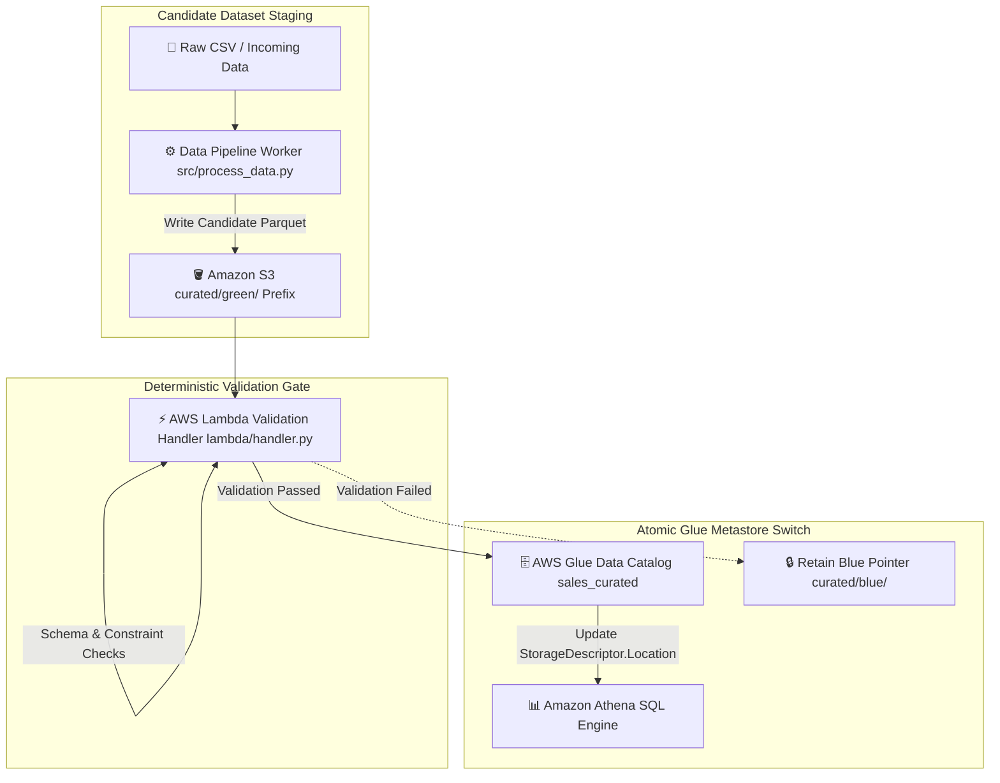

# 🔄 DataFlip — Zero-Downtime Blue/Green Data Switching Pattern

[](https://aws.amazon.com/s3/)
[](https://aws.amazon.com/glue/)
[](https://aws.amazon.com/athena/)
[](https://www.terraform.io/)
[](https://docs.pytest.org/)

---

## 📌 Executive Summary & Problem Statement

### The Problem
Updating active analytical cloud datasets in object storage (like Amazon S3) presents severe risks to production analytics pipelines:
1. **Query Corruption During In-Place Overwrites:** Overwriting active Parquet datasets in S3 causes in-flight **Amazon Athena** or Spark queries to fail with missing file partition errors.
2. **High Latency & Data Copying Costs:** Copying multi-gigabyte or terabyte datasets between S3 folders during production deployment creates significant network latency and extra AWS storage fees.
3. **Complex Rollbacks:** Reverting to a previous dataset version after discovering corrupted data requires lengthy S3 copy restoration jobs.

### The DataFlip Solution
DataFlip is an **AWS cloud analytics deployment engine** implementing a zero-downtime, zero-copy **Blue/Green Data Switching Pattern**:
- **Metadata Pointer Switching:** Instead of moving or copying data files, DataFlip updates table location pointers (`StorageDescriptor.Location`) inside the **AWS Glue Data Catalog** via Boto3 in milliseconds.
- **Candidate Data Isolation:** Candidate datasets stage in isolated `curated/green/` S3 prefixes without affecting active `curated/blue/` queries.
- **Deterministic Validation Gates:** An **AWS Lambda** handler validates row counts, non-null constraints, and schema rules before promoting candidate datasets.
- **Zero Cost Baseline:** Operates at a $0.00 infrastructure cost under the AWS Free Tier using micro-Parquet files.

---

## 📐 System Architecture



---

## 🔍 Step-by-Step Technical Workflow

1. **Candidate Staging:** Raw incoming sales data is converted into compressed **Apache Parquet** format (`src/process_data.py`) and stored under the target candidate prefix in S3 (`curated/green/`). The active production query path points to `curated/blue/`.
2. **Lambda Trigger & Schema Inspection:** The **AWS Lambda validation handler** (`lambda/handler.py`) is triggered. It evaluates the candidate dataset for critical data quality rules:
   - File existence and Parquet header validity
   - Row count non-zero threshold
   - Non-null checks on primary key columns (`transaction_id`, `timestamp`)
3. **Atomic Catalog Switch:** If all validation tests pass, Lambda executes a Boto3 API call to `glue.update_table()`, updating `StorageDescriptor.Location` from `s3://bucket/curated/blue/` to `s3://bucket/curated/green/`.
4. **Zero-Downtime Query Execution:** All subsequent **Amazon Athena** SQL queries immediately read from the new `green` dataset location. Ongoing queries finish gracefully against `blue` files without failure.
5. **Instant Rollback:** If validation fails or a downstream issue is discovered, DataFlip executes an instant rollback by updating the Glue Catalog pointer back to `curated/blue/` in under 50 milliseconds.

---

## 📂 Repository Directory Structure

```text
dataflip/
├── src/
│   ├── dataflip.py                 # Core Glue Catalog Location Switcher Logic
│   ├── process_data.py             # CSV-to-Parquet Processing & Staging Pipeline
│   └── query_data.py               # Athena SQL Query Execution Script
├── lambda/
│   └── handler.py                  # AWS Lambda Validation Handler
├── data/
│   ├── raw/                        # Sample Input Raw Datasets
│   ├── blue/                       # Active Production Parquet Dataset Prefix
│   ├── green/                      # Candidate Parquet Dataset Prefix
│   └── manifest.json               # Pointer Switching Metadata Manifest
├── sql/
│   ├── athena_ddl.sql              # AWS Glue Data Catalog DDL Scripts
│   └── athena_queries.sql          # Benchmark Analytics Queries
├── terraform/
│   ├── main.tf                     # Provider Definition
│   ├── s3.tf                       # S3 Buckets & Public Access Block Settings
│   ├── glue.tf                     # AWS Glue Data Catalog Database & Table Definitions
│   ├── lambda.tf                   # Lambda Validation Function Definition
│   ├── iam.tf                      # IAM Least-Privilege Execution Policies
│   ├── variables.tf                # Terraform Variable Definitions
│   └── outputs.tf                  # Infrastructure Outputs
├── tests/
│   ├── test_dataflip_local.py      # Integration Tests for Data Flip Engine
│   ├── test_lambda_handler.py      # Lambda Validation Handler Tests
│   └── test_process_data.py        # Data Processing & Parquet Verification Tests
├── requirements.txt                # Python Dependencies
└── README.md                       # Comprehensive Project Documentation
```

---

## 🛠️ Technology Stack Breakdown

- **Cloud & Analytics Services:** Amazon S3, AWS Glue Data Catalog, Amazon Athena, AWS Lambda, CloudWatch
- **Languages & Storage Formats:** Python 3.11+, Boto3 SDK, Apache Parquet, SQL
- **Testing & IaC:** Pytest (17 passing unit and integration tests), Terraform 1.14+

---

## 🚀 How to Run & Deploy Locally

### Prerequisites
- Python 3.11+ installed
- Terraform 1.14+ installed

### 1. Run Automated Pytest Suite (17 Tests)
```bash
pytest tests/ -v
```

### 2. Provision AWS Infrastructure via Terraform
```bash
cd terraform
terraform init
terraform plan
terraform apply -auto-approve
```

---

## 📄 License
Distributed under the MIT License. See `LICENSE` for details.
