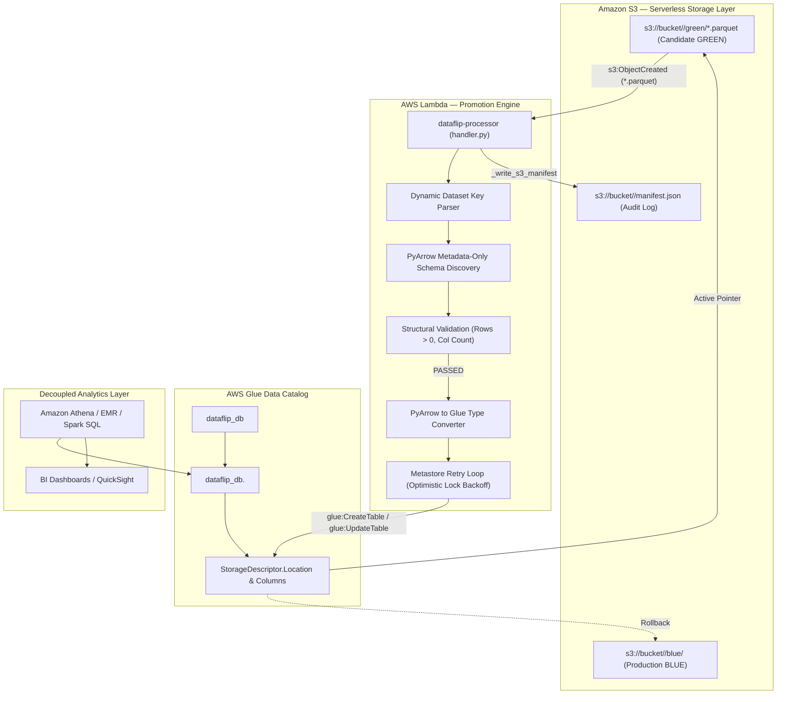

# 🔄 DataFlip — Serverless Blue/Green Data Deployment Platform

[](https://www.python.org/)
[](https://aws.amazon.com/s3/)
[](https://aws.amazon.com/glue/)
[](https://aws.amazon.com/lambda/)
[](https://aws.amazon.com/athena/)
[](https://arrow.apache.org/)
[](https://www.terraform.io/)
[](https://docs.pytest.org/)
[](LICENSE)

---

## 📌 Overview

**DataFlip** is a domain-agnostic, dataset-driven **Serverless Blue/Green Data Deployment Platform** designed for analytical data lakes on AWS.

In traditional analytical workflows, deploying updated datasets requires moving or overwriting multi-gigabyte or terabyte files in place, or hardcoding fixed schemas into pipeline microservices. This naive approach introduces severe production risks:
- In-flight analytical queries (Amazon Athena, Presto, EMR, Spark) fail with `FileNotFoundError` or read partially written data.
- Moving large files between prefixes incurs network latency, egress, and S3 API costs.
- Rigid schemas lock deployment code to a single business domain (e.g. sales or IoT only).
- Reverting a bad data release requires slow, expensive backup restoration or ETL recomputation.

**DataFlip eliminates these risks by decoupling physical data storage from metastore pointers.** 

Any arbitrary Parquet dataset uploaded to `s3://<bucket>/<dataset_name>/green/<file>.parquet` triggers an event-driven AWS Lambda microservice. Using **PyArrow metadata-only inspection**, Lambda discovers the schema and validates dataset integrity without loading heavy table records into memory. It then automatically provisions or updates the AWS Glue Data Catalog table definition (`StorageDescriptor.Columns` and `StorageDescriptor.Location`) to point to the candidate GREEN dataset in milliseconds.

If anomalies are detected, a single rollback action reverts the Glue catalog location pointer back to the known-good BLUE dataset prefix (`s3://<bucket>/<dataset_name>/blue/`).

---

## 📐 Architecture & Data Flow

```text
S3 Storage (s3://<bucket>/<dataset_name>/green/*.parquet)
       │
       ▼  (s3:ObjectCreated notification)
AWS Lambda (handler.py)
       │
       ├── 1. Extract <dataset_name> dynamically from S3 key
       ├── 2. Inspect Parquet footer via PyArrow (metadata-only schema & row counts)
       ├── 3. Validate structural integrity (columns exist, rows > 0)
       ├── 4. Convert PyArrow data types to AWS Glue Catalog types
       │
   [Validation Status]
       ├── PASSED ──> Create or Update Glue Table (dataflip_db.<dataset_name>)
       │              ├── Sets StorageDescriptor.Columns = discovered schema
       │              ├── Sets StorageDescriptor.Location = s3://<bucket>/<dataset_name>/green/
       │              └── Writes active deployment manifest (s3://<bucket>/<dataset_name>/manifest.json)
       │              └── Athena queries immediately resolve to GREEN data
       │
       ├── FAILED ──> Retain Glue Table pointing to BLUE
       │              └── Logs rejection reason to s3://<bucket>/<dataset_name>/manifest.json
       │
       └── ROLLBACK ─> Sets StorageDescriptor.Location = s3://<bucket>/<dataset_name>/blue/
                      └── Instant rollback to known-good BLUE dataset
```



---

## 🏗️ Core Production Components

### 1. Domain-Agnostic Dataset Routing
The platform does not hardcode table or domain names. When an object is uploaded, the Lambda key parser extracts the dataset name:
- `s3://bucket/telemetry/green/readings.parquet` $
ightarrow$ manages table `dataflip_db.telemetry`
- `s3://bucket/customers/green/users.parquet` $
ightarrow$ manages table `dataflip_db.customers`
- `s3://bucket/financial_ledger/green/tx.parquet` $
ightarrow$ manages table `dataflip_db.financial_ledger`

The exact same Lambda code orchestrates deployments for any structured dataset.

### 2. Metadata-Only PyArrow Schema Discovery
Rather than downloading multi-gigabyte files into memory or parsing complete records into pandas, DataFlip utilizes `pyarrow.parquet.ParquetFile`:
- Inspects only the file metadata footer dictionary.
- Extracts column names, nested schemas, and PyArrow data types in milliseconds.
- Validates row counts (`metadata.num_rows > 0`) without decoding page payloads.
- Converts PyArrow data types (`int32`, `int64`, `float64`, `string`, `date32`, `timestamp`, `decimal`, etc.) directly into AWS Glue Catalog compatible data types (`int`, `bigint`, `double`, `string`, `date`, `timestamp`, `decimal(p,s)`).

### 3. Dynamic Glue Catalog Table Management
- **Automatic Provisioning**: If `dataflip_db.<dataset_name>` does not exist, Lambda dynamically creates the table with Parquet SerDe, discovered columns, and location.
- **Synchronized Schema & Location Updates**: When an existing table is updated, Lambda updates both `StorageDescriptor.Location` and `StorageDescriptor.Columns` in the Glue table definition to ensure Athena queries immediately match the promoted dataset structure without schema mismatch.
- **Architectural Clarification**: Updating the Glue table definition modifies catalog metadata pointers to point to the promoted S3 dataset prefix; it does not provide relational database-style two-phase commit transactions.

### 4. Metastore Optimistic Concurrency Control
When concurrent processes or crawlers interact with the AWS Glue Catalog, Glue uses version-based optimistic locking (`ConcurrentModificationException`). `lambda/handler.py` implements a Get-Modify-Retry loop with exponential backoff and jitter to reliably update table definitions without deployment failures.

### 5. Automated S3 Ingress & Least-Privilege IAM
- **S3 Bucket Notification (`terraform/s3_notification.tf`)**: Filtered to `.parquet` suffixes, triggering Lambda on candidate dataset uploads. Lambda guards verify the key belongs to a `green/` slot before executing promotion.
- **Scoped IAM Permissions (`terraform/iam.tf`)**: Execution permissions are tightly scoped to `arn:aws:glue:*:*:table/dataflip_db/*`, `aws_glue_catalog_database.dataflip_db.arn`, and the analytics S3 bucket.

---

## 📁 Repository Structure

```
dataflip/
├── lambda/
│   ├── handler.py              # Domain-agnostic Blue/Green release, validation & rollback engine
│   └── __init__.py
├── sql/
│   ├── athena_ddl.sql          # AWS Glue Catalog database & reference DDL templates
│   └── athena_queries.sql      # Domain-agnostic analytical query patterns for Athena
├── terraform/                  # Production AWS Infrastructure as Code
│   ├── main.tf                 # Provider and backend configuration
│   ├── variables.tf            # Project variables
│   ├── outputs.tf              # Resource outputs (Lambda ARN, S3 bucket, Glue DB)
│   ├── s3.tf                   # S3 bucket, encryption, TLS enforcement, lifecycle rules
│   ├── glue.tf                 # AWS Glue database definition (dynamic table provisioning)
│   ├── lambda.tf               # AWS Lambda packaging and deployment configuration
│   ├── iam.tf                  # Scoped least-privilege IAM policies
│   └── s3_notification.tf      # S3 event notification & Lambda invocation permission
├── tests/
│   ├── test_lambda_handler.py  # 19 comprehensive unit and integration tests
│   └── __init__.py
├── docs/
│   ├── aws_cloud_architecture.md # Cloud engineering architecture deep-dive
│   ├── cloud_interview_qa.md     # Technical interview preparation guide
│   ├── iam_policy.json           # Standalone least-privilege IAM policy reference
│   └── walkthrough.md            # Complete architecture walkthrough
├── requirements.txt            # Production dependencies (boto3, pyarrow, powertools, pytest)
├── pytest.ini                  # Pytest configuration
└── README.md                   # System documentation
```

---

## 🚀 Getting Started

### 1. Setup Environment
```bash
git clone https://github.com/sanmathik8/Dataflip.git
cd dataflip

python -m venv .venv
source .venv/bin/activate  # On Windows: .venv\Scripts\activate

pip install -r requirements.txt
```

### 2. Run Automated Test Suite
Executes the full test suite covering key parsing, PyArrow type conversions, schema validation, dynamic table creation/updating, concurrency retries, and rollback:
```bash
pytest -v tests/
```

### 3. Deploy Cloud Infrastructure via Terraform
Provisions the S3 bucket, S3 event notification, Glue database, Lambda function, and least-privilege IAM roles:
```bash
cd terraform
terraform init
terraform plan
terraform apply
```

---

## 📄 License
This project is licensed under the MIT License — see the [LICENSE](LICENSE) file for details.
