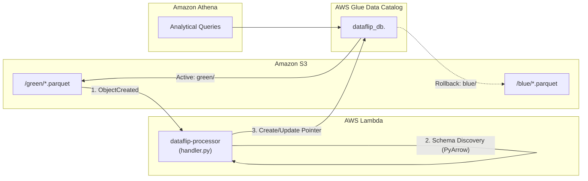

# 🔄 DataFlip — Serverless Blue/Green Data Deployment Platform

[](https://www.python.org/)
[](https://aws.amazon.com/)
[](https://www.terraform.io/)
[](https://docs.pytest.org/)
[](LICENSE)

A domain-agnostic, serverless platform for zero-downtime **Blue/Green data releases** on AWS.

Instead of moving multi-gigabyte files or hardcoding fixed schemas, DataFlip updates AWS Glue Data Catalog metadata pointers in milliseconds. Downstream analytical queries (Amazon Athena) instantly resolve the promoted dataset.

---

## 📐 Architecture & Workflow



### How It Works:
1. **Upload**: A candidate Parquet file lands in `s3://<bucket>/<dataset_name>/green/<file>.parquet`.
2. **Event Trigger**: S3 sends an `ObjectCreated` event to the Lambda processor (`handler.py`).
3. **Dataset Identification**: Lambda dynamically parses `<dataset_name>` and slot (`green`) from the S3 key, sanitizing table names for Glue. Uploads to `blue/` or other paths are safely ignored.
4. **Schema Discovery**: PyArrow reads the Parquet footer dictionary to inspect schema and row counts without decoding table records into memory.
5. **Type Mapping**: PyArrow data types are converted to AWS Glue / Athena types (`boolean`, `int`, `bigint`, `double`, `string`, `date`, `timestamp`, `decimal`).
6. **Promotion**: Lambda creates or updates the Glue table (`dataflip_db.<dataset_name>`):
   - Sets `StorageDescriptor.Location` = `s3://<bucket>/<dataset_name>/green/`
   - Sets `StorageDescriptor.Columns` = discovered schema
   - Retries on `ConcurrentModificationException` with exponential backoff
7. **Audit Manifest**: Writes deployment status to `s3://<bucket>/<dataset_name>/manifest.json`.
8. **Rollback**: Sending `{"action": "rollback", "dataset_name": "<dataset>"}` immediately reverts the Glue table pointer back to `s3://<bucket>/<dataset_name>/blue/`.

### 💡 Design Note: Invocation Modes
The Lambda engine (`lambda/handler.py`) supports two invocation paths and branches automatically based on payload shape:
1. **Live S3 ObjectCreated Events**: Defined via `aws_s3_bucket_notification` in [`terraform/s3_notification.tf`](terraform/s3_notification.tf) (filtered to `.parquet` suffixes) and authorized via `aws_lambda_permission`. When candidate Parquet data lands in `<dataset>/green/`, S3 automatically fires an `ObjectCreated` event to invoke Lambda.
2. **Direct JSON Invocation**: Direct invocation via the AWS CLI (`aws lambda invoke`), SDKs, or test suites using a direct JSON payload (e.g., `{"action": "rollback", "dataset_name": "<name>"}` for immediate rollback, or simulated S3 event records).

> [!NOTE]
> **Cloud Deployment Status**: The S3 trigger infrastructure is fully defined and passes `terraform validate`. However, it is not currently `terraform apply`'d to a live AWS account (`terraform.tfstate` shows `resources: []`). This is deliberate, to avoid ongoing AWS costs during development and testing, rather than a missing feature.

---

## 🏗️ What Was Implemented

| Component | File | Description |
| :--- | :--- | :--- |
| **Lambda Processor** | [`lambda/handler.py`](lambda/handler.py) | Dynamic dataset routing, PyArrow schema discovery, type conversion, Glue table create/update, optimistic locking retry, and rollback. |
| **Infrastructure as Code** | [`terraform/`](terraform/) | Complete AWS setup: S3 bucket & event notifications, Glue database, Lambda function (512MB RAM), and least-privilege IAM policies. |
| **Athena SQL** | [`sql/`](sql/) | Parameterized DDL template and analytical query patterns for dynamically created Glue tables. |
| **Test Suite** | [`tests/test_lambda_handler.py`](tests/test_lambda_handler.py) | 21 unit and integration tests covering key parsing, type mappings, schema extraction, table creation, updates, concurrency retries & race conditions, and rollback. |

---

## 📁 Repository Structure

```text
dataflip/
├── lambda/
│   ├── handler.py              # Lambda release, validation & rollback engine
│   └── __init__.py
├── sql/
│   ├── athena_ddl.sql          # Glue catalog reference DDL template
│   └── athena_queries.sql      # Dynamic Athena analytical queries
├── terraform/                  # AWS Infrastructure as Code
│   ├── main.tf                 # Terraform provider configuration
│   ├── variables.tf            # Variables (AWS region, environment, layer ARNs)
│   ├── outputs.tf              # Resource outputs (S3 bucket, Lambda ARN, Glue DB)
│   ├── s3.tf                   # S3 bucket, encryption, TLS enforcement, lifecycle
│   ├── glue.tf                 # Glue database definition
│   ├── lambda.tf               # Lambda function configuration (512MB, Python 3.11)
│   ├── iam.tf                  # Scoped least-privilege IAM roles and policies
│   └── s3_notification.tf      # S3 event notification & Lambda permission
├── tests/
│   ├── test_lambda_handler.py  # 21 unit & integration tests
│   └── __init__.py
├── docs/                       # Architecture deep-dive & interview Q&A
├── requirements.txt            # Production dependencies (boto3, pyarrow, powertools, pytest)
├── pytest.ini                  # Pytest configuration
└── README.md                   # System documentation
```

---

## 🚀 Quickstart

### 1. Run Tests
```bash
python -m venv .venv
source .venv/bin/activate  # On Windows: .venv\Scripts\activate
pip install -r requirements.txt

pytest -v tests/
```

### 2. Deploy Infrastructure
```bash
cd terraform
terraform init
terraform plan
terraform apply
```

---

## 📄 License
This project is licensed under the MIT License — see [LICENSE](LICENSE).
