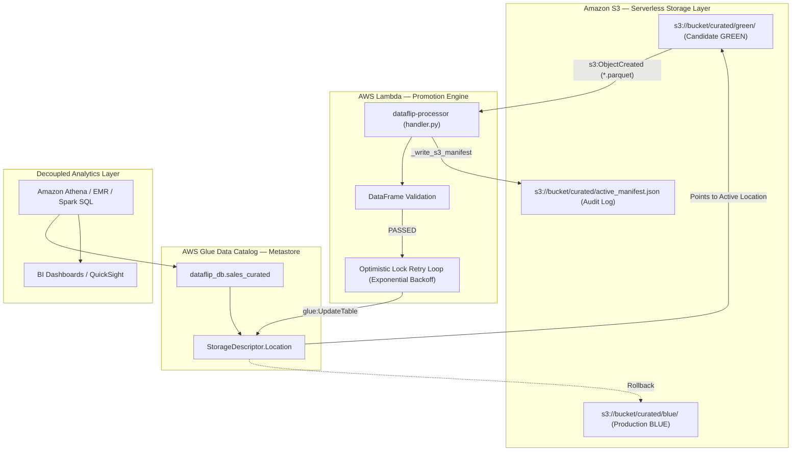

# 🔄 DataFlip — Serverless Blue/Green Deployment Pattern for Analytical Data Lakes

[](https://www.python.org/)
[](https://aws.amazon.com/s3/)
[](https://aws.amazon.com/glue/)
[](https://aws.amazon.com/lambda/)
[](https://aws.amazon.com/athena/)
[](https://www.terraform.io/)
[](https://docs.pytest.org/)
[](LICENSE)

---

## 📌 Overview

**DataFlip** is an enterprise-grade, serverless **Blue/Green deployment engine** designed for analytical data lakes in AWS.

In traditional ETL pipelines, releasing updated datasets requires copying or overwriting multi-gigabyte or terabyte files in place. This naive approach creates severe production risks:
- In-flight Amazon Athena, Presto, or EMR queries fail with `FileNotFoundError` or read half-written, corrupt data.
- Copying large datasets between S3 buckets incurs network latency and unnecessary egress/API costs.
- Reverting a bad data release requires slow, expensive backup restoration or ETL recomputation.

**DataFlip solves this by switching metadata pointers instead of moving physical data objects.** 

Datasets are written to stationary target prefixes in Amazon S3 (`curated/blue/` or `curated/green/`). When a candidate Parquet file lands in `curated/green/`, an automated S3 event triggers an AWS Lambda microservice that validates the candidate data and atomically updates the AWS Glue Data Catalog table location pointer in milliseconds.

The result is **zero query downtime**, **near-zero data transfer costs**, and **a rollback measured in milliseconds, not the minutes/hours of a backup restore**.

---

## 📐 Production Architecture & Data Flow

```text
S3 (curated/green/*.parquet)
       │
       ▼  (s3:ObjectCreated notification)
AWS Lambda (handler.py)
       │
       ├──> Validate DataFrame (non-empty rows, required columns)
       │
   [Validation Status]
       ├── PASSED ──> boto3 glue.update_table(Location="s3://.../curated/green/")
       │              └──> Updates S3 Audit Manifest (s3://.../curated/active_manifest.json)
       │              └──> Amazon Athena queries immediately route to GREEN
       │
       ├── FAILED ──> Retain Glue Table Location pointing to BLUE
       │              └──> Writes rejection reason to S3 Audit Manifest
       │
       └── ROLLBACK (Manual Action)
                      └──> boto3 glue.update_table(Location="s3://.../curated/blue/")
                      └──> Instant revert to known-good BLUE dataset
```



---

## 🏗️ Core Production Components

### 1. Automated S3 Ingress Trigger (`terraform/s3_notification.tf`)
Uploading a candidate Parquet dataset to `s3://${S3_BUCKET}/curated/green/*.parquet` automatically invokes the Lambda function via an `aws_s3_bucket_notification` with a scoped, least-privilege `aws_lambda_permission` resource policy.

### 2. Dual-Invocation Lambda Microservice (`lambda/handler.py`)
The Lambda processor natively supports two invocation patterns:
- **Event-Driven (S3 Trigger)**: Automatically parses S3 ObjectCreated records, streams the Parquet bytes via `boto3` and `io.BytesIO`, converts to DataFrame, and validates.
- **Direct Payload / Rollback**: Accepts manual payloads (`{"records": [...]}`) for test pipelines or `{"action": "rollback"}` to instantaneously revert the catalog pointer back to BLUE.

### 3. Metastore Optimistic Concurrency Control
When multiple workers or crawlers interact with the AWS Glue Catalog simultaneously, Glue protects table metadata using version-based optimistic locking (`ConcurrentModificationException`). 

`lambda/handler.py` implements a **Get-Modify-Retry** loop with exponential backoff and jitter to fetch the updated catalog version and complete the pointer flip reliably without deployment failure.

### 4. Structured Observability via AWS Lambda Powertools
`lambda/handler.py` leverages `aws_lambda_powertools.Logger`. Contextual metadata is attached once per invocation lifecycle via `logger.append_keys(request_id=..., dataset=...)`:
```json
{
  "level": "INFO",
  "location": "update_glue_table_location:47",
  "message": "[Glue Switch Success] Attempt 1/3: Updated 'dataflip_db.sales_curated' to 's3://bucket/curated/green/'",
  "timestamp": "2026-09-06 15:10:32,494+0530",
  "service": "dataflip",
  "request_id": "c28b49e1-74bf-4b0c-a9df-6d0f507b99c7",
  "dataset": "sales_curated"
}
```

---

## 📁 Repository Structure

```
dataflip/
├── lambda/
│   ├── handler.py              # AWS Lambda release, validation & rollback microservice
│   └── __init__.py
├── sql/
│   ├── athena_ddl.sql          # AWS Glue Data Catalog external table DDL
│   └── athena_queries.sql      # Athena production analytical queries
├── terraform/                  # Full AWS Infrastructure as Code
│   ├── main.tf                 # Provider and backend configuration
│   ├── variables.tf            # Project variables
│   ├── outputs.tf              # Resource outputs (Lambda ARN, S3 bucket)
│   ├── s3.tf                   # S3 bucket, encryption, TLS enforcement, lifecycle rules
│   ├── glue.tf                 # AWS Glue database & table definitions
│   ├── lambda.tf               # AWS Lambda packaging and deployment
│   ├── iam.tf                  # Scoped least-privilege IAM policies
│   └── s3_notification.tf      # S3 event notification & Lambda permission
├── tests/
│   ├── test_lambda_handler.py  # Unit tests for Lambda handler, retries, and S3 trigger
│   └── __init__.py
├── docs/
│   ├── aws_cloud_architecture.md # Cloud engineering architecture deep-dive
│   ├── cloud_interview_qa.md     # Technical interview preparation guide
│   ├── iam_policy.json           # Standalone least-privilege IAM policy reference
│   └── walkthrough.md            # Complete architecture walkthrough
├── requirements.txt            # Production dependencies
├── pytest.ini                  # Pytest configuration
└── README.md                   # System documentation
```

---

## 🚀 Getting Started

### 1. Setup Environment
```bash
git clone https://github.com/sanmathik8/Dataflip.git
cd dataflip

python -m venv .venv
source .venv/bin/activate  # On Windows: .venv\Scripts\activate

pip install -r requirements.txt
```

### 2. Run Automated Test Suite
Executes unit tests against the Lambda handler, concurrency retries, rollback logic, and S3 trigger handling:
```bash
pytest
```

### 3. Deploy Cloud Infrastructure via Terraform
Provisions the S3 bucket, S3 event notification, Glue database, Glue external table, Lambda function, and least-privilege IAM roles:
```bash
cd terraform
terraform init
terraform plan
terraform apply
```

---

## 📄 License
This project is licensed under the MIT License — see the [LICENSE](LICENSE) file for details.
