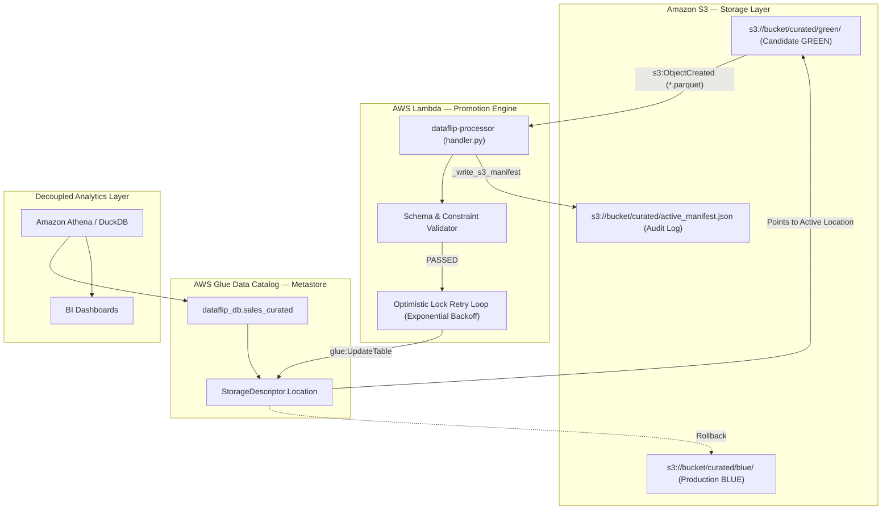

# 🔄 DataFlip — Serverless Blue/Green Deployment Pattern for Analytical Datasets

[](https://www.python.org/)
[](https://aws.amazon.com/s3/)
[](https://aws.amazon.com/glue/)
[](https://aws.amazon.com/lambda/)
[](https://pandera.readthedocs.io/)
[](https://duckdb.org/)
[](https://www.terraform.io/)
[](https://docs.pytest.org/)
[](LICENSE)

---

## 📌 Overview

**DataFlip** is a cloud-native pattern that brings software engineering's **Blue/Green deployment pattern** to analytical data lakes and warehouse environments.

In traditional ETL pipelines, releasing updated datasets requires copying or overwriting multi-gigabyte or terabyte files in place. This naive approach creates severe production risks:
- In-flight Amazon Athena, Presto, or DuckDB queries fail with `FileNotFoundError` or read corrupted, half-written data.
- Copying large datasets between S3 buckets incurs network latency and unnecessary egress/API costs.
- Reverting a bad data release requires slow, expensive backup restoration or ETL recomputation.

**DataFlip solves this by switching metadata pointers instead of moving physical data objects.** 

Datasets are written to stationary target directories (`blue/` or `green/`). New releases and rollbacks are executed in milliseconds by atomically updating the active pointer—enabling **zero query downtime**, **near-zero data transfer costs**, and **a rollback measured in milliseconds, not the minutes/hours of a backup restore**.

---

## 🏗️ Architecture: Dual-Layer Design

DataFlip provides two symmetric implementations of the Blue/Green pointer pattern:

```
┌─────────────────────────────────────────────────────────────────────────────┐
│                           LOCAL SIMULATION ENGINE                           │
│  src/dataflip.py  ──(updates pointer)──>  data/manifest.json                │
│  Query Layer: DuckDB (src/query_data.py) reads active Parquet pointer       │
│  Purpose: Free, offline developer experimentation and rapid CI/CD unit tests│
└─────────────────────────────────────────────────────────────────────────────┘
                                      ▲
                                      │ Architectural Parity
                                      ▼
┌─────────────────────────────────────────────────────────────────────────────┐
│                          PRODUCTION CLOUD ENGINE                            │
│  lambda/handler.py  ──(boto3 glue:UpdateTable)──> AWS Glue Data Catalog     │
│  Query Layer: Amazon Athena / EMR / Spark SQL queries Glue Catalog Table    │
│  Purpose: Enterprise-scale, serverless release orchestration in AWS         │
└─────────────────────────────────────────────────────────────────────────────┘
```

### 1. Local Engine (`src/dataflip.py`)
- Simulates the Blue/Green lifecycle using isolated local directories (`data/blue/` and `data/green/`) and a lightweight JSON ledger (`data/manifest.json`).
- Resolves the active production path dynamically via `engine.get_active_dataset_path()`.
- Allows developers and CI/CD pipelines to validate releases and test rollback logic locally without requiring AWS credentials or paying cloud costs.

### 2. Cloud Engine (`lambda/handler.py`)
- Production AWS Lambda microservice that executes atomic metadata switches against **AWS Glue Data Catalog**.
- Triggered automatically when candidate Parquet files are uploaded to `s3://${S3_BUCKET}/curated/green/*.parquet` via an S3 Bucket Notification.
- Instead of moving S3 objects, it updates the external table's `StorageDescriptor.Location` pointer:
  `s3://${S3_BUCKET}/curated/blue/` $\longleftrightarrow$ `s3://${S3_BUCKET}/curated/green/`
- Consumers querying through **Amazon Athena**, AWS EMR, or QuickSight query the logical Glue table (`dataflip_db.sales_curated`) and are immediately routed to the new active dataset with zero downtime.

---

## 📐 Cloud Data Flow



---

## 🛡️ Declarative Schema Validation with Pandera

DataFlip decouples the deployment engine from dataset schemas. Validation is **schema-driven** via [Pandera](https://pandera.readthedocs.io/), allowing developers to define data contracts declaratively:

```python
import pandera.pandas as pa
from pandera.pandas import Column, Check, DataFrameSchema
from src.dataflip import DataFlipEngine

# 1. Define schema contract declaratively
SALES_SCHEMA = DataFrameSchema({
    "order_id": Column(int, nullable=False),
    "order_date": Column(str, nullable=False),
    "product": Column(str, nullable=False),
    "category": Column(str, nullable=False),
    "quantity": Column(int, Check.gt(0)),
    "unit_price": Column(float, Check.ge(0)),
    "region": Column(str, nullable=False),
    "revenue": Column(float, Check.ge(0)),
})

# 2. Pass schema into the deployment engine
engine = DataFlipEngine(base_dir=".", schema=SALES_SCHEMA, dataset_filename="sales.parquet")

# 3. Candidate datasets violating constraints are rejected automatically
success, message = engine.deploy_green("data/green/sales.parquet")
if not success:
    print(f"Deployment rejected: {message}")  # BLUE remains active
```

---

## 🔍 Observability & Cloud Concurrency

### Structured Logging with AWS Lambda Powertools
`lambda/handler.py` leverages `aws_lambda_powertools.Logger`. Contextual metadata is attached once per invocation lifecycle via `logger.append_keys(request_id=..., dataset=...)`:
```json
{
  "level": "INFO",
  "location": "update_glue_table_location:47",
  "message": "[Glue Switch Success] Attempt 1/3: Updated 'dataflip_db.sales_curated' to 's3://bucket/curated/green/'",
  "timestamp": "2026-09-06 15:10:32,494+0530",
  "service": "dataflip",
  "request_id": "c28b49e1-74bf-4b0c-a9df-6d0f507b99c7",
  "dataset": "sales_curated"
}
```

### Optimistic Concurrency Control
When multiple workers or crawlers interact with the AWS Glue Catalog simultaneously, Glue protects table metadata using version-based optimistic locking (`ConcurrentModificationException`). 

Rather than failing the deployment, `lambda/handler.py` implements a **Get-Modify-Retry** loop with exponential backoff and jitter to fetch the updated catalog version and complete the pointer flip reliably.

---

## ⚖️ Production-Ready Components vs. Architectural Trade-offs

To defend this architecture honestly in technical interviews, the system distinguishes between production-grade components and intentional architectural boundaries:

### ✅ Production-Ready Components
1. **Automated S3 Ingress Trigger (`terraform/s3_notification.tf`)**:
   Uploading a candidate Parquet dataset to `s3://${S3_BUCKET}/curated/green/*.parquet` automatically triggers the AWS Lambda processor via an `aws_s3_bucket_notification` with a scoped, least-privilege `aws_lambda_permission` resource policy.
2. **Dual Invocation Support in Lambda**:
   `lambda_handler()` natively handles both automated S3 event notifications (`event['Records'][0]['s3']`) and manual payload calls (`{"records": [...]}` or `{"action": "rollback"}`).
3. **Atomic Glue Metadata Switching**:
   Updating `StorageDescriptor.Location` on AWS Glue Data Catalog external tables routes all downstream Athena/EMR queries instantaneously with zero downtime.
4. **Metastore Optimistic Concurrency Control**:
   The `ConcurrentModificationException` retry loop in `lambda/handler.py` handles catalog update collisions using exponential backoff and jitter.
5. **Structured Cloud Observability**:
   `aws_lambda_powertools.Logger` automatically injects `request_id` and `dataset` context across all log lines.
6. **Declarative Schema Contract Enforcement**:
   Pandera `DataFrameSchema` strictly enforces column nullability, data types, and value boundaries before promotion.

### ⚠️ Known Trade-offs & Limitations (Honest System Boundaries)
1. **Memory Bounds for Multi-Gigabyte Files**:
   The Lambda reads candidate Parquet bytes into memory via `io.BytesIO` for validation, which is optimal for datasets within Lambda memory limits (<500 MB). For multi-gigabyte or terabyte files, an enterprise pipeline should either validate Parquet footer metadata lazily without scanning row data, or delegate row-level validation to an AWS Glue / EMR Spark job prior to pointer promotion.
2. **Decoupled Local vs. Cloud Implementations**:
   The local simulation engine (`src/dataflip.py`) operates offline via `data/manifest.json` and DuckDB, while the cloud microservice (`lambda/handler.py`) operates via AWS Glue and S3. They mirror the exact same architectural pattern, but run independently to allow offline development without cloud costs.

---

## 📁 Repository Structure

```
dataflip/
├── src/
│   ├── dataflip.py             # Core schema-driven Blue/Green engine
│   ├── process_data.py         # CSV to Parquet conversion & validation
│   └── query_data.py           # DuckDB analytical query execution
├── lambda/
│   └── handler.py              # AWS Lambda release & rollback microservice
├── examples/
│   └── demo.py                 # 4-step end-to-end lifecycle demonstration
├── tests/
│   ├── test_dataflip_local.py  # Local engine & Pandera validation tests
│   ├── test_lambda_handler.py  # Lambda handler, retry, and mock tests
│   └── test_process_data.py    # Ingestion & conversion tests
├── sql/
│   ├── analytics.sql           # DuckDB analytical query reference
│   ├── athena_ddl.sql          # AWS Glue Catalog external table DDL
│   └── athena_queries.sql      # Athena production analytics queries
├── terraform/                  # Full AWS infrastructure as code (S3, Glue, Lambda, IAM, S3 Notification)
├── data/                       # Local simulation storage (manifest, blue, green, raw)
├── requirements.txt            # Python production dependencies
└── pytest.ini                  # Pytest configuration
```

---

## 🚀 Getting Started

### 1. Setup Environment
```bash
git clone https://github.com/sanmathik8/Dataflip.git
cd dataflip

python -m venv .venv
source .venv/bin/activate  # On Windows: .venv\Scripts\activate

pip install -r requirements.txt
```

### 2. Run the End-to-End Demo
Executes the full 4-stage lifecycle (Baseline Blue $\rightarrow$ Valid Green Promotion $\rightarrow$ Rollback to Blue $\rightarrow$ Invalid Green Rejection):
```bash
python examples/demo.py
```

### 3. Run Local DuckDB Analytics
Executes analytical SQL queries directly against whichever dataset partition is currently active:
```bash
python src/query_data.py
```

### 4. Run the Automated Test Suite
Executes all 23 unit and integration tests across the local engine, Lambda handler, and data processor:
```bash
pytest
```

### 5. Deploy Cloud Infrastructure with Terraform (Optional)
Provisions the S3 bucket, S3 event notification, Glue database, Glue external table, Lambda function, and least-privilege IAM roles:
```bash
cd terraform
terraform init
terraform plan
terraform apply
```

---

## 📄 License
This project is licensed under the MIT License — see the [LICENSE](LICENSE) file for details.
