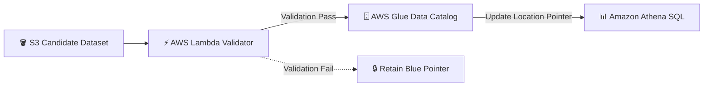

# 🔄 DataFlip — Zero-Downtime Blue/Green Data Switching

[](https://aws.amazon.com/s3/)
[](https://aws.amazon.com/glue/)
[](https://aws.amazon.com/athena/)
[](https://www.terraform.io/)
[](https://docs.pytest.org/)

A cloud-based analytics data switching system on AWS implementing a **zero-downtime, zero-copy Blue/Green Data Deployment Pattern**.

---

## 🎯 Architectural Overview

DataFlip enables instant releases and rollbacks of analytical cloud datasets without copying data or corrupting active SQL queries. Candidate Parquet datasets stage in `curated/green/` S3 prefixes. An **AWS Lambda** validation handler verifies row counts and non-null constraints before updating `StorageDescriptor.Location` in the **AWS Glue Data Catalog** via Boto3, switching live **Amazon Athena** SQL queries in milliseconds.



---

## ⚡ Key Engineering Features

- **⚡ Atomic Blue/Green Metadata Switching:** Updates Glue Data Catalog table location metadata properties (`StorageDescriptor.Location`) via Boto3, executing instant dataset switches.
- **🛡️ Deterministic Lambda Validation:** Runs row-count checks, schema validation, and non-null constraint checks before promoting candidate datasets.
- **💰 Zero Data-Copy Deployment:** Eliminates dataset copying costs and network latency, operating at a $0.00 baseline cost under the AWS Free Tier.
- **🧪 17-Test Pytest Suite:** Includes comprehensive unit and integration tests (`test_dataflip_local.py`, `test_lambda_handler.py`, `test_process_data.py`).
- **🏗️ Terraform IaC:** Declaratively provisions S3 buckets, Glue Data Catalog tables (`dataflip_db.sales_curated`), Lambda validation functions, and IAM policies (`s3.tf`, `glue.tf`, `lambda.tf`, `iam.tf`).

---

## 🛠️ Technology Stack

- **Cloud Services:** Amazon S3, AWS Glue Data Catalog, Amazon Athena, AWS Lambda, CloudWatch
- **Languages & Libraries:** Python, Boto3 SDK, Apache Parquet
- **Testing & IaC:** Pytest (17 passing integration tests), Terraform 1.14+

---

## 🚀 Quickstart & Usage

### 1. Run Local Integration Tests
```bash
pytest tests/
```

### 2. Deploy Infrastructure via Terraform
```bash
cd terraform
terraform init
terraform apply
```

---

## 📄 License
Distributed under the MIT License.
