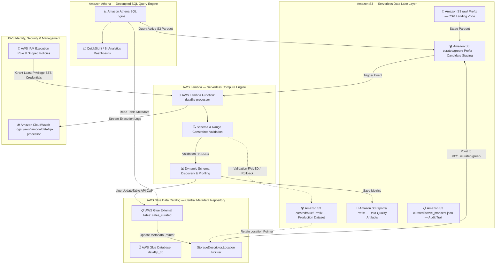

# DataFlip — AWS Cloud Architecture & Engineering Deep-Dive

**DataFlip** is a cloud-first, serverless AWS analytics system implementing a **Blue/Green Data Deployment Pattern**. This document outlines the 10 core AWS Cloud Engineering pillars powering DataFlip.

---

## 📐 Official AWS Cloud Architecture Diagram




---


## 1. Amazon S3 Storage Architecture & Security

### Bucket & Prefix Design
```text
s3://dataflip-analytics-dev/
├── raw/                      # Landing zone for incoming CSV files
├── reports/                  # Automated HTML EDA profiling reports (ydata-profiling)
└── curated/
    ├── blue/                 # Active / Known-good production Parquet dataset
    ├── green/                # Candidate Parquet dataset undergoing validation
    └── active_manifest.json  # S3 metadata audit trail
```


### S3 Security Controls
* **Block Public Access**: Enabled across all 4 S3 public access block settings (`IgnorePublicAcls`, `BlockPublicAcls`, `BlockPublicPolicy`, `RestrictPublicBuckets`).
* **Server-Side Encryption**: SSE-S3 (`AES256`) applied by default to all objects at rest.
* **Least-Privilege Policy**: Bucket access is restricted exclusively to the Lambda execution role and authorized Glue catalog components.
* **Versioning**: Enabled on `curated/` prefixes to prevent accidental deletion of historical known-good datasets.

---

## 2. AWS IAM Security & Least Privilege

### Lambda Execution Role (`dataflip-lambda-execution-role`)
Lambda requires explicit permissions granted via an **IAM Execution Role** attached to the function execution context.

#### Trust Policy (`AssumeRole`)
Allows the Lambda service principal to assume the role:
```json
{
  "Version": "2012-10-17",
  "Statement": [
    {
      "Effect": "Allow",
      "Principal": { "Service": "lambda.amazonaws.com" },
      "Action": "sts:AssumeRole"
    }
  ]
}
```

#### Permission Policy Breakdown
No `AdministratorAccess` is granted. Scoped permissions include:
1. **S3 Permissions**: `s3:GetObject`, `s3:PutObject`, `s3:ListBucket` restricted to `arn:aws:s3:::dataflip-analytics-*`.
2. **Glue Permissions**: `glue:GetTable`, `glue:UpdateTable`, `glue:GetDatabase` restricted to `dataflip_db.sales_curated`.
3. **CloudWatch Logs**: `logs:CreateLogGroup`, `logs:CreateLogStream`, `logs:PutLogEvents` restricted to `/aws/lambda/dataflip-processor`.

---

## 3. AWS Lambda Serverless Processing Engine

### Execution Model & Trigger
* **Runtime**: Python 3.11 / Python 3.14 compatible.
* **Memory & Timeout**: 128 MB RAM, 30-second timeout (sufficient for micro-dataset processing).
* **Environment Variables**:
  - `S3_BUCKET`: `dataflip-analytics-dev`
  - `GLUE_DATABASE`: `dataflip_db`
  - `GLUE_TABLE`: `sales_curated`

### Event Handler Logic (`lambda/handler.py`)
1. **Receives Candidate Data**: Triggered by S3 object notification or payload invocation.
2. **Executes Deterministic Validation**:
   - Row count > 0.
   - Presence of required schema columns.
   - Non-null `order_id`.
   - Numeric constraints (`quantity > 0`, `unit_price >= 0`, `revenue >= 0`).
3. **Executes Catalog Switch (PASS)**:
   - Invokes `glue.update_table()` via `boto3`.
   - Updates `StorageDescriptor.Location` to `s3://dataflip-analytics-dev/curated/green/`.
4. **Handles Failure (FAIL)**:
   - Retains Glue Catalog location at `s3://dataflip-analytics-dev/curated/blue/`.
   - Writes validation audit log to CloudWatch.

---

## 4. AWS Glue Data Catalog & Athena SQL Integration

### How Glue Metadata Drives Athena
Athena is a decoupled, serverless query engine. It relies entirely on the **AWS Glue Data Catalog** to resolve schema types and S3 storage locations.

```text
Athena Query -> Glue Catalog (dataflip_db.sales_curated) -> S3 Parquet Data
```

### The Switching Mechanism
DataFlip switches production analytics **without data copying or downtime** by executing an in-place Glue table update:

```python
glue_client.update_table(
    DatabaseName='dataflip_db',
    TableInput={
        'Name': 'sales_curated',
        'StorageDescriptor': {
            'Location': 's3://dataflip-analytics-dev/curated/green/' # Switches pointer!
        }
    }
)
```

---

## 5. Amazon Athena SQL Analytics

### Queries Against Curated Data
Athena queries execute against the Glue catalog table `dataflip_db.sales_curated`:

```sql
-- Query 1: Total Revenue
SELECT ROUND(SUM(revenue), 2) AS total_revenue FROM dataflip_db.sales_curated;

-- Query 2: Revenue by Category
SELECT category, ROUND(SUM(revenue), 2) AS revenue FROM dataflip_db.sales_curated GROUP BY category;
```

### Cost Awareness & Performance
* **Columnar Parquet Format**: Athena scans only requested columns rather than entire CSV files, reducing data scanned by up to 80-90%.
* **Cost Model**: $5.00 per TB scanned. Micro-datasets in DataFlip scan kilobytes, resulting in **$0.00** net cost per query.

---

## 6. Amazon CloudWatch Logging & Observability

* **Log Group**: `/aws/lambda/dataflip-processor`
* **Log Output**: Structured JSON logging recording execution time, candidate dataset validation status, Glue Catalog location updates, and rollback events.

---

## 7. Event-Driven Architecture

```text
S3 Object Creation (`raw/` or `curated/green/`)
         │
         ▼
S3 Event Notification / EventBridge
         │
         ▼
AWS Lambda (`lambda/handler.py`)
         │
    ┌────┴────┐
    ▼         ▼
Glue Update   CloudWatch Log
```

---

## 8. AWS Cost Safety Architecture

* **Serverless Compute**: Lambda charges $0.00 under the 1,000,000 free monthly requests.
* **Storage**: S3 micro-datasets consume <1MB (Free Tier includes 5GB).
* **Catalog**: Glue Catalog requests are free under 1,000,000 requests/month.
* **Query Engine**: Athena scans kilobytes per query (<$0.0001 per query).
* **Infrastructure**: Zero EC2 instances, zero ECS clusters, zero NAT Gateways.
